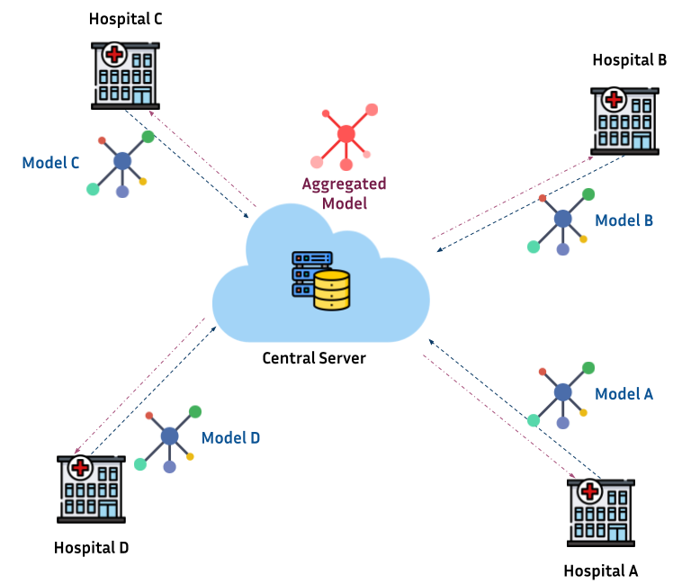

# Introduction

Standard machine learning approaches require to have a centralizaed dataset in order to train a model. In certain scenarios like in the biomedical field, this is not straightforward due to several reasons like:

* Privacy concerns:
  * General Data Protection Regulation (GDPR): https://gdpr-info.eu
  * Californian Consumer Privacy Act (CCPA): https://oag.ca.gov/privacy/ccpa
* Ethical comitee approval
* Transfering data to a centralized location

This slows down research in healthcare and limits the generalization of certain models.

## Federated Learning

Federated learning (FL) is a machine learning procedure whose goal is to train a model without having data centralized. The goal of FL is to train higher quality models by having acces to more data than centralized approaches, as well as to keep data securely descentralized. 

### Infrastructure of a federated learning setting in healthcare

A common scenario of federated learning in healthcare is shown as follows:

Hospitals (a.k.a. clients) across several geographical locations hold data of interest for a researcher. These data can be "made available" for local training but, only the model is authorized to be shared with a third thrusted party (e.g. research center). Once all the models are gathered, different techniques are proposed for **aggregating** them as a single global model. Then, the **Agregated model** can be used as purposed (e.g. training a neural network for segmentation).

### Theoretical background

One of the critical points in FL is knowing how to aggregate the models submitted by the clients. The main problem relies on finding the best set of **parameters** that define your model in function of the submissions made by the clients.

In a canonical form:

$$
\min_w F(w) ,\quad \textrm{where} F(w):=\sum_{k=1}^{m} p_k F_k(w)
$$

Where $m$ is the total number of clients, $p_k>=0$, and $\sum_k p_k=1$ , and $F_k$ is the local objective function for the $k$-th client. The impact (contribution) of each client to the aggregation of the global model is given by $p_k$.

One of the first proposed methodologies in FL for model aggregation was **Federated Averaging `FedAVG`** by (MacMahan _et_ al, 2017), the idea behind it was to define the contribution of each client as $p_k=\frac{n_k}{n}$ where $n_k$ is the number of datapoints in the client $k$ and $n$ is the total number of observations studied.

### Challenges in federated learning

The main challenges in FL are associated to:

- **Communication efficiency:** number of iterations between clients and central location to train an optimal model.

- **Data hetereogenity:** how to build generalized models with heterogeneous data?

- **Security:** adversarial attacks and data leakeage.
